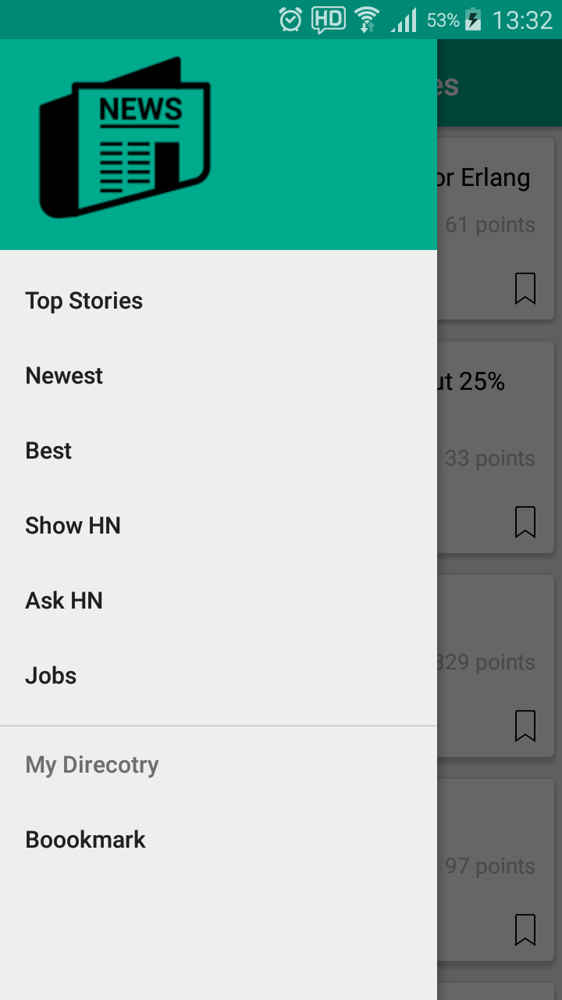
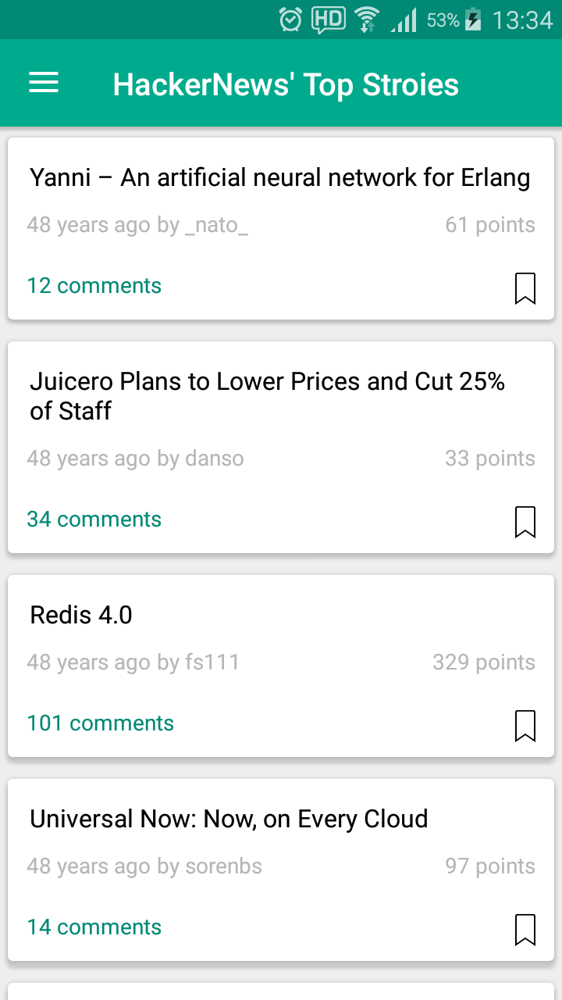
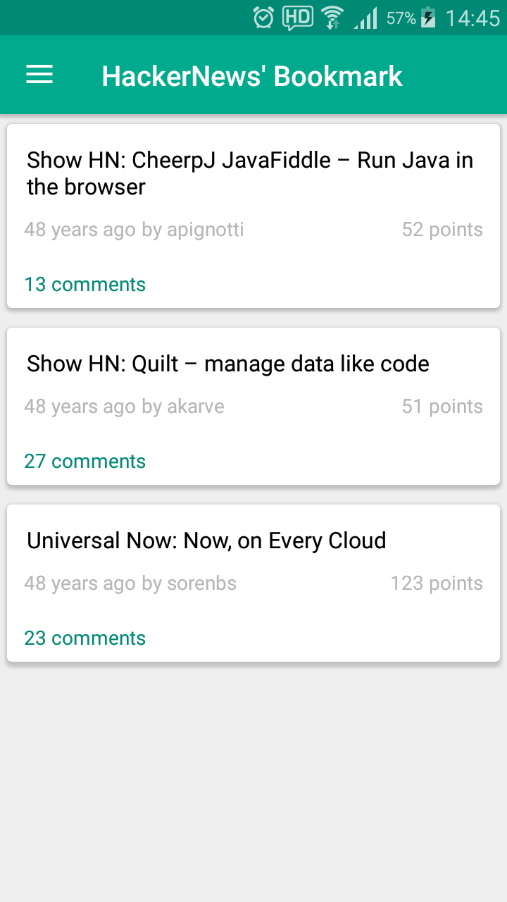

# HackerNews_android

## Description
This project's purpose is for implementing an Android client application using Hacker News API.

## Features
●	View five lists of Hacker News
    ○	Top
    ○	New
    ○	Best
    ○	Show HN
    ○	Ask HN
    ○	Job
●	Detail View of a News
●	Bookmark a New detail
●	View a list of Bookmark

## Prerequisites

For Hacker News API, https://github.com/HackerNews/API
For setup your firebase application, https://firebase.google.com/docs/android/setup

## Screenshot

  
  
  
  

